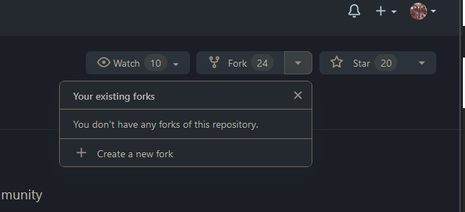
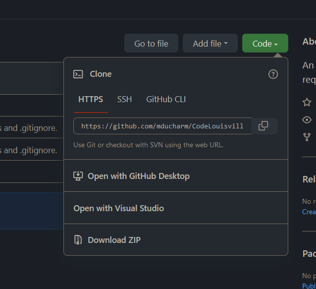
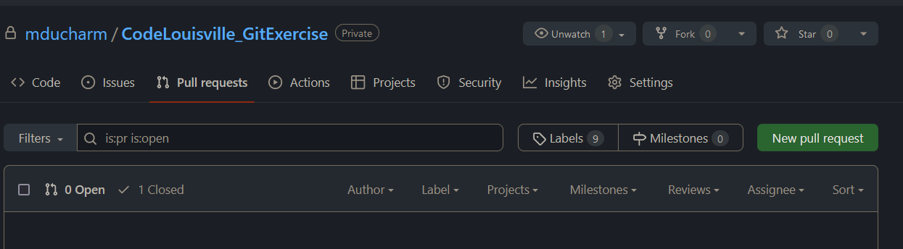
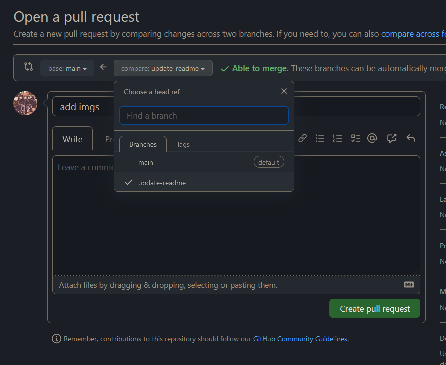

# Code Louisville Git Exercise

Git is an essential part of a software developer's toolkit. This exercise will involve making a pull request with a small change, so you can see how developers collaborate.

## Steps

1. [Fork](#fork-the-repository)
1. [Clone](#clone-the-repository)
1. [Branch](#create-a-branch)
1. [Make a commit](#make-a-commit)
1. [Create a pull request](#create-a-pull-request)

### Fork the repository

Forking creates a copy of the repo, where you're free to make changes.



When contributing to a public repo, you typically make changes to your forked repo, and then create a request for your changes to be merged into the main repository (i.e. a pull request).

### Clone the repository

Cloning a repo is when we copy the source code onto our local machine. You can clone a repo by clicking on the `Code` button to copy the repo's URL, and then running the command below:



```powershell
git clone https://github.com/mducharm/CodeLouisville_GitExercise.git
```

### Create a branch

We create *branches* to group related changes.

```powershell
git checkout -b add-greeting
```

### Make a commit

In the `Program.cs` file, add a greeting with your name like this below:

```csharp
Console.WriteLine("Hello! I'm ___");
```

```powershell
# stage the changes 
git add Program.cs 

# alternatively, `git add *` to add changes for all files

# commit the changes
git commit -m "added my greeting"

# push your new commit to GitHub: git push {remote} {branch}
git push origin main 
```

Note: when cloning a forked repo, it should automatically set the `origin` remote to be the URL of your forked repo. If for some reason this doesn't happen, you can add and view the current remotes for your cloned repo like so:

```powershell
# add a remote
git remote add origin https://github.com/{your_username}/CodeLouisville_GitExercise.

# view existing remotes
git remote -v
```

### Create a Pull Request

Navigate back to the original repo (not your forked copy). Under the `Pull Requests` tab, click `New pull request`. Alternatively, a `Compare & pull request` option may also show with your newly created branch, which you can also select.



Ensure that your branch is selected in the dropdown displayed below. You can scroll down to view a 'diff' between your changes and the existing code.

After adding a title and description, click `Create pull request`.

